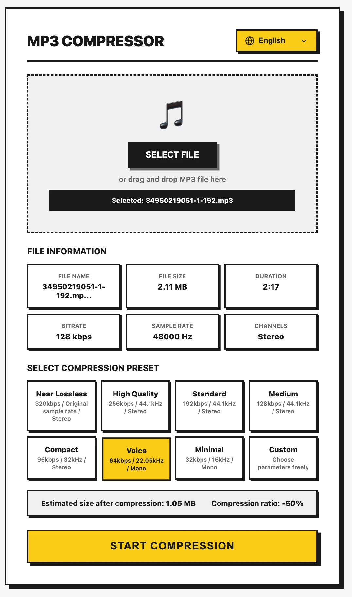

# MP3 Compressor

A powerful online MP3 compression tool that runs entirely in your browser. No file uploads to any server.



## Online Demo

Try it online: https://mp3-compressor.tools.ioatlas.com/

## Why This Tool?

Unlike other online MP3 compressors, this tool provides:

- **Detailed File Info Preview** - View complete audio metadata before compression (duration, bitrate, sample rate, channels)
- **Rich Compression Options** - 8 preset profiles + fully customizable parameters
- **Real-time Estimation** - Preview estimated file size and compression ratio before processing
- **100% Local Processing** - Files never leave your device, ensuring complete privacy

## Features

### File Information Preview

Automatically analyzes and displays after upload:

| Info | Description |
|------|-------------|
| File Size | Auto-converted to B/KB/MB |
| Duration | MM:SS format |
| Bitrate | Original bitrate (kbps) |
| Sample Rate | Original sample rate (Hz) |
| Channels | Mono/Stereo |

### Compression Presets

8 preset profiles covering different use cases:

| Preset | Bitrate | Sample Rate | Channels | Best For |
|--------|---------|-------------|----------|----------|
| Near Lossless | 320 kbps | Original | Stereo | Hi-fi music archiving |
| High Quality | 256 kbps | 44.1 kHz | Stereo | Music collection |
| Standard | 192 kbps | 44.1 kHz | Stereo | Everyday listening |
| Medium | 128 kbps | 44.1 kHz | Stereo | Balance quality & size |
| Compact | 96 kbps | 32 kHz | Stereo | Save storage space |
| Voice | 64 kbps | 22.05 kHz | Mono | Podcasts/Voice content |
| Minimal | 32 kbps | 16 kHz | Mono | Smallest file size |
| Custom | Adjustable | Adjustable | Adjustable | Full control |

### Custom Parameters

In "Custom" mode, freely adjust:

- **Bitrate**: 32, 48, 64, 80, 96, 112, 128, 160, 192, 256, 320 kbps
- **Sample Rate**: 11025, 16000, 22050, 32000, 44100, 48000 Hz
- **Channels**: Mono / Stereo

### Other Features

- Drag & drop file upload
- Real-time processing progress
- Auto-generated filename with compression parameters
- Multi-language support (English, 繁體中文, 日本語, Deutsch, Français)

## Tech Stack

- **React 18** - UI framework
- **TypeScript** - Type safety
- **Vite** - Build tool
- **FFmpeg WASM** - Audio processing engine

## Local Development

```bash
# Install dependencies
bun install

# Start dev server
bun run dev

# Build for production
bun run build
```

## How It Works

This tool uses the WebAssembly version of FFmpeg to process audio files directly in your browser:

1. Web Audio API parses audio metadata
2. FFmpeg WASM handles the actual compression
3. All processing happens locally - files never leave your device

## License

MIT
